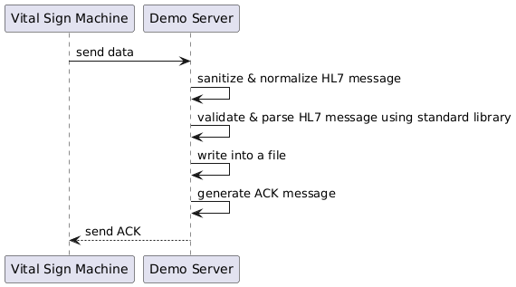

# Vital Sign Machine HL7 TCP Connection Demo

## Overview

This project demonstrates how to establish a connection with a **Vital Sign Machine** over TCP, process incoming HL7 messages using the [HAPI HL7v2 Library](https://hapifhir.github.io/hapi-hl7v2/index.html), and save the processed data into a file. It is designed for developers integrating HL7-based communication with medical devices.

---

## Features

- **TCP Connection**: Connects to a Vital Sign Machine via TCP/IP.
- **HL7 Parsing**: Processes HL7 messages using the HAPI HL7v2 library.
- **Data Persistence**: Saves parsed messages to a file for further use.

---

## Prerequisites

Ensure the following tools and libraries are installed on your system:

1. **Java Development Kit (JDK)** - Version 17.
2. **Maven** - Dependency management and project build.
3. **Vital Sign Machine** - Configured to send HL7 messages over TCP.
4. **HAPI HL7v2 Library** - Included in the project dependencies.

---

## Project Architecture

### Key Components

- **HL7MLLPListener**  
  Establishes and maintains a connection with the Vital Sign Machine. Receives incoming HL7 messages over TCP.

- **HL7MessageProcessor**  
  Uses the **HAPI HL7v2 Library** to parse and validate the HL7 messages received.

- **FileWriter**  
  Writes validated messages to a file for further use.

---

## Workflow



---

## Test with Netcat

```bash
echo "MSH|^~\&|LABOLINK||HIS||20151013104430||ORU^R01|1001|P|2.3
PID|1||000
OBR|1|||||20151013104427||||||||20151013104430
OBX|1|NM|SYSTOLIC||100|mmHg|||||F|||20151013104427
OBX|2|NM|DIASTOLIC||100|mmHg|||||F|||20151013104427
OBX|3|NM|PULSE||100|bpm|||||F|||20151013104427
OBX|4|NM|HEIGHT||150.0|cm|||||F|||20151013104428
OBX|5|NM|WEIGHT||50.0|kg|||||F|||20151013104428
OBX|6|NM|BMI||22.22222222222222|kg/m2|||||F|||20151013104428
OBX|7|NM|SPO2||95.0|%|||||F|||20151013104429
OBX|8|NM|TEMP||25.0|C|||||F|||20151013104429" | nc [IP_ADDRESS] [PORT]
```

## Messages

### Message from Thermometer

```hl7
MSH|^~\&|LABOLINK44|LABOTRON MEDICAL|HIS|BMS-HOSxP|20250107153518||ORU^R01|22701|P|2.3
PID|1||000000444
OBR|1|||||20250107152959||||||||20250107153518
OBX|1|ST|TEMP||34.0|C||HH|||F|||20250107153012
OBX|2|ST|TEMPF||183.2|F||HH|||F|||20250107153012
```

### Message from Blood Pressure Monitor

```hl7
MSH|^~\&|LABOLINK44|LABOTRON MEDICAL|HIS|BMS-HOSxP|20250107153542||ORU^R01|22801|P|2.3
PID|1||000000444
OBR|1|||||20250107152439||||||||20250107153542
OBX|1|ST|SYSTOLIC||135|mmHg||HH|||F|||20250107152534
OBX|2|ST|DIASTOLIC||91|mmHg||HH|||F|||20250107152534
OBX|3|ST|PULSE||68|bpm|||||F|||20250107152534
```

### Message from Weighing Scale

```hl7
MSH|^~\&|LABOLINK44|LABOTRON MEDICAL|HIS|BMS-HOSxP|20250107152820||ORU^R01|21601|P|2.3
PID|1||000000344
OBR|1|||||20250107152749||||||||20250107152820
OBX|1|ST|HEIGHT||175.54|cm|||||F|||20250107152817
OBX|2|ST|WEIGHT||67.0|kg|||||F|||20250107152817
OBX|3|ST|BMI||21.74|kg/m2||HH|||F|||20250107152817
```